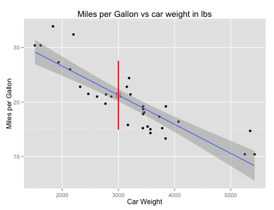

## Application to predict the mpg of your next car

> - Need to accurately predict mpg of next you purchase
> - Consumers request objective answers
> - Factory estimates not always honest?
> - Ease of use essential - see prototype


--- .class #id
## Where do we go from here?

 - Gather more and more accurate data
 - Create a model with multiple predictors
 - Design a mobile App with a web based back end
 - Develop other features to complement the mpg estimates
<br>
<br>
<br>


##                                                          Short Demo --->

--- .class #id 

## How to predict the MPG using cars weight:


```r
data(mtcars)
library(caret)
mpg <- mtcars$mpg
weight <- mtcars$wt
lM <- lm(mpg ~ weight)
newdata <- data.frame(weight = 3)
p <- predict(lM, newdata, interval = "predict")
```

1. Load the data - mtcars
2. requires the caret package in R
3. Uses the linear regression model implemented in R by lm()
4. Create new dataframe with desired weigth (here in 1000 lbs)
5. Run prediction function with model

--- &twocol

## Sample Plot with Cars of various types ##

*** =left
<br>



*** =right
  <br>
  <br>
Print-out of an example estimating the MPG of a 
car with about 3000 lbs of dry weight:
<br>


```
##     fit   lwr   upr
## 1 21.25 14.93 27.57
```

<br>
fit = fitted value

lwr = lower end of prediction interval

upr = upper end of prediction interval
